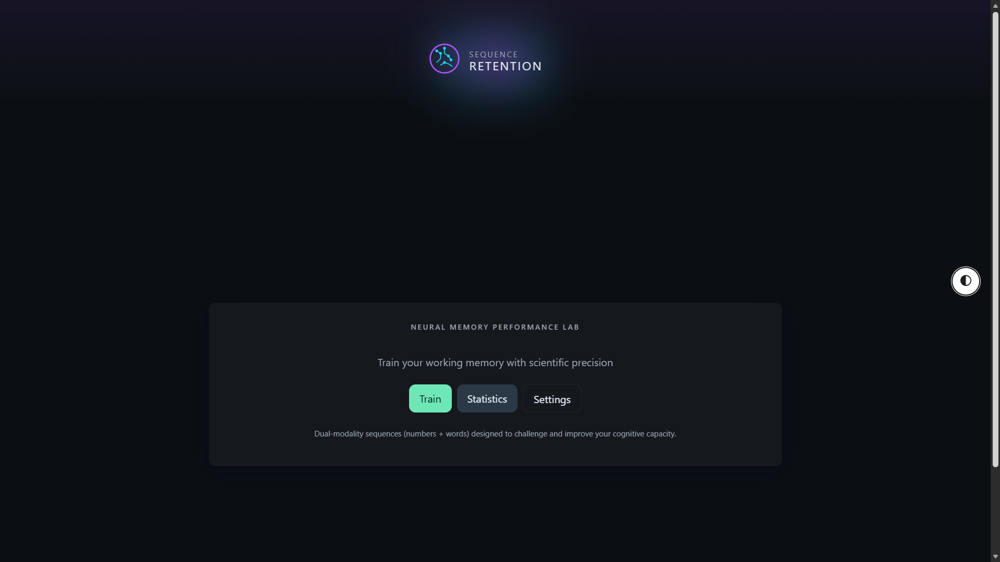
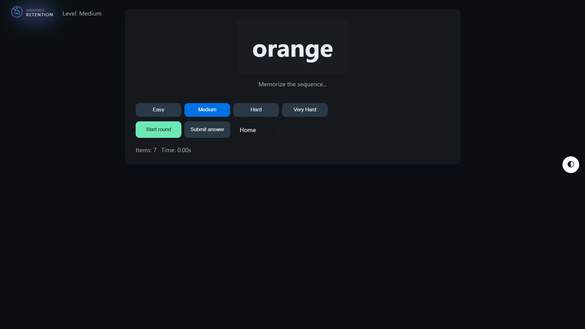
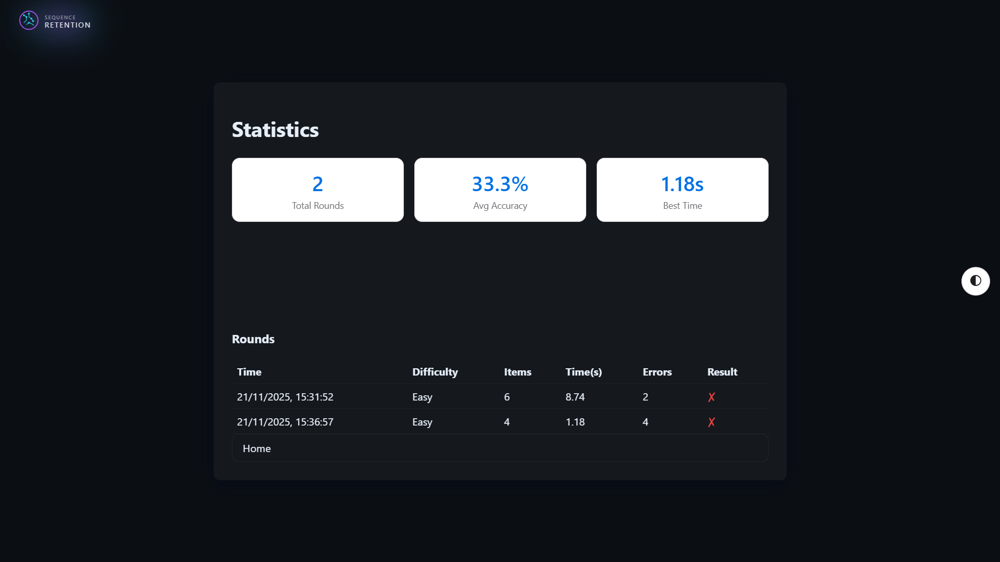
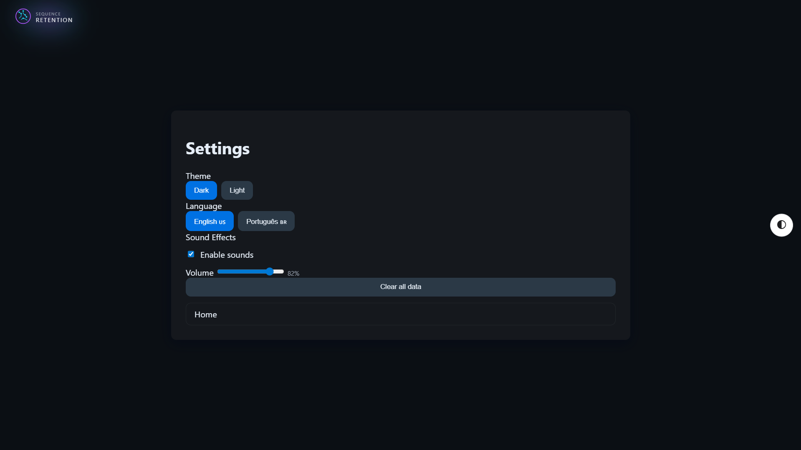

# Sequence Retention

> Neural Memory Performance Lab - Scientific working memory training with dual-modality sequences

[]()
[](https://creativecommons.org/licenses/by-nc-sa/4.0/)

## 🎯 Overview

Professional web application designed for cognitive training and working memory research. Features scientifically-designed mixed sequences with configurable difficulty levels, real-time performance tracking, and comprehensive data persistence.

## ✨ Features

### Core Gameplay
- **Dual-Modality Sequences**: Mixed numbers (0-9) and words from a curated vocabulary
- **4 Difficulty Levels**: Easy, Medium, Hard, Very Hard with preset configurations
- **Progressive Display**: Item-by-item sequential presentation with timing control
- **Answer Validation**: Real-time feedback with detailed error analysis
- **Performance Tracking**: Time, accuracy, and error metrics per round

### User Experience
- 🌓 **Light/Dark Theme**: Smooth transitions with localStorage persistence
- 🌍 **Bilingual Interface**: English 🇺🇸 / Português 🇧🇷 with dynamic translation
- 🔊 **Sound Effects**: Configurable audio feedback (show item, correct, wrong)
- 📊 **Statistics Dashboard**: Comprehensive performance analytics with Chart.js visualization
- 💾 **Local Persistence**: All rounds and settings saved in localStorage

### Technical Excellence
- **Zero Dependencies** (except Chart.js for stats visualization)
- **ES6 Modules**: Clean, modular architecture
- **Responsive Design**: Mobile-first CSS with custom properties
- **Accessibility**: ARIA labels, keyboard navigation, semantic HTML
- **Static Deployment**: No build step required, pure HTML/CSS/JS

## 🚀 Quick Start

### Local Development

```bash
# Navigate to project directory
cd short-term-memory-project

# Serve the public folder
python -m http.server 8000 --directory ./public

# Open browser to http://localhost:8000
```

### Production Deployment

Deploy the `public/` folder to any static hosting service:
- **Netlify**: Drag & drop `public/` folder
- **Vercel**: `vercel --prod public/`
- **GitHub Pages**: Push `public/` to `gh-pages` branch
- **AWS S3**: `aws s3 sync public/ s3://your-bucket --acl public-read`

## 📁 Project Structure

```
public/
├── index.html              # Home/splash screen
├── game.html               # Main training interface
├── stats.html              # Performance analytics
├── settings.html           # Configuration panel
└── assets/
    ├── css/
    │   ├── base.css        # CSS reset & variables
    │   ├── layout.css      # Grid & layout utilities
    │   ├── components.css  # UI components
    │   ├── theme-dark.css  # Dark theme (default)
    │   └── theme-light.css # Light theme
    ├── js/
    │   ├── game_core.js    # Sequence generation & validation
    │   ├── game_controller.js # Game state & UI orchestration
    │   ├── storage.js      # localStorage abstraction
    │   ├── theme.js        # Theme management
    │   ├── i18n.js         # Internationalization
    │   ├── sound.js        # Sound effects system
    │   ├── main.js         # Home page initialization
    │   ├── settings.js     # Settings page logic
    │   └── stats.js        # Statistics rendering
    ├── lang/
    │   ├── en.json         # English translations
    │   └── pt.json         # Portuguese translations
    ├── sfx/
    │   ├── show_item.wav   # Item display sound
    │   ├── correct.wav     # Correct answer sound
    │   └── wrong.wav       # Wrong answer sound
    └── images/
        └── logo.svg        # Application logo
```

## 🎮 Usage

### Training Session Workflow

1. **Select Difficulty**: Choose from Easy (4-6 items) to Very Hard (16-20 items)
2. **Start Round**: Click "Start round" to begin sequence presentation
3. **Memorize**: Watch items appear one-by-one with timed intervals
4. **Answer**: Type each item + Enter to create answer chips
5. **Submit**: Click "Submit answer" when complete
6. **Review**: Modal shows accuracy, time, and detailed item-by-item results

### Settings & Customization

Access **Settings** page to configure:
- **Theme**: Toggle between Dark/Light mode
- **Language**: Switch between English/Portuguese
- **Sound Effects**: Enable/disable audio feedback + volume control
- **Data Management**: Clear all training history

## 🔊 Sound System

Three distinct audio cues:
- **show_item.wav**: Plays when each sequence item appears
- **correct.wav**: Plays on perfect round completion
- **wrong.wav**: Plays when errors are detected

Configure in Settings → Sound Effects (enable checkbox + volume slider).

## 🌍 Internationalization

All UI text supports EN/PT-BR. Add new languages:

1. Create `public/assets/lang/{code}.json` (copy from `en.json`)
2. Translate all keys
3. Add language button in `settings.html`
4. Update `settings.js` language switcher

## 🧪 Python Backend (Optional)

The project includes Python scripts for offline testing:

```bash
# Activate virtual environment (if using venv)
source .venv/bin/activate  # Linux/Mac
# or
.venv\Scripts\Activate.ps1  # Windows

# Run CLI version
python basic.py

# Initialize database
python init_db.py
```

**Python Modules**:
- `game_core.py`: Core logic (sequence generation, validation)
- `logger_sqlite.py`: SQLite persistence layer
- `basic.py`: Command-line interface
- `init_db.py`: Database initialization

## 📊 Data Persistence

All data stored in `localStorage`:

| Key | Content |
|-----|---------|
| `nst_rounds_v1` | Array of round results (JSON) |
| `nst_settings_v1` | User settings (JSON) |
| `nst_theme` | Current theme ('dark' / 'light') |
| `nst_lang` | Current language ('en' / 'pt') |
| `nst_sounds` | Sound config (enabled, volume) |

## 🎨 Theming

CSS variables enable easy customization. Override in custom stylesheets or modify `theme-*.css` files.

## 🌐 Browser Compatibility

- ✅ Chrome 90+ (recommended)
- ✅ Firefox 88+
- ✅ Safari 14+
- ✅ Edge 90+

**Requirements**: ES6 modules, CSS custom properties, localStorage, Web Audio API

## 📝 License

This work is licensed under [CC BY-NC-SA 4.0](https://creativecommons.org/licenses/by-nc-sa/4.0/).

**Attribution-NonCommercial-ShareAlike 4.0 International**
- ✅ Share and adapt for non-commercial purposes
- ✅ Provide attribution to the original author
- ✅ Distribute derivatives under the same license
- ❌ Commercial use prohibited without permission

## 📸 Screenshots

### 🏠 Home


### 🎯 Gameplay


### 📊 Statistics


### ⚙️ Settings


---

**Built for cognitive science research and neural memory performance optimization**
